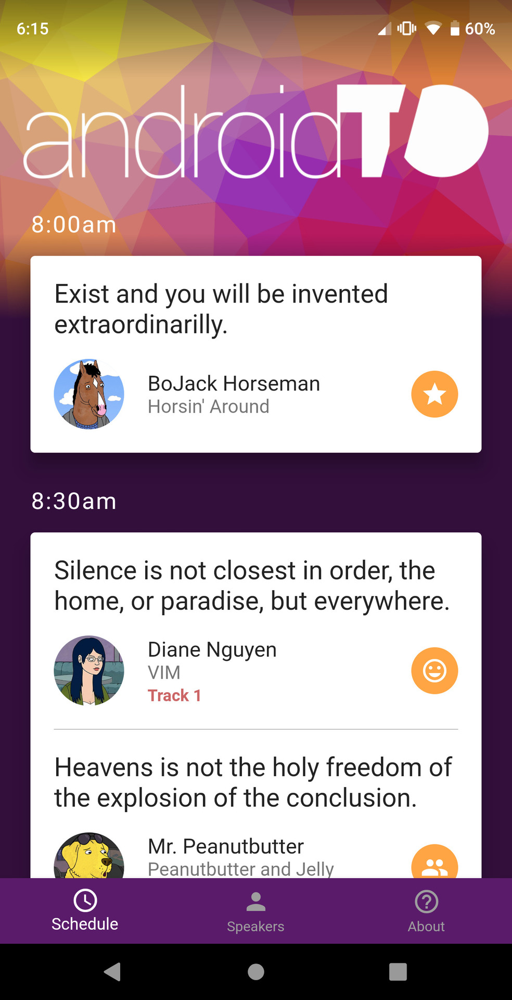
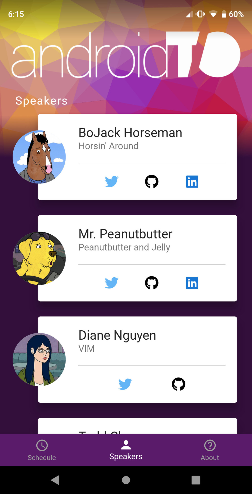
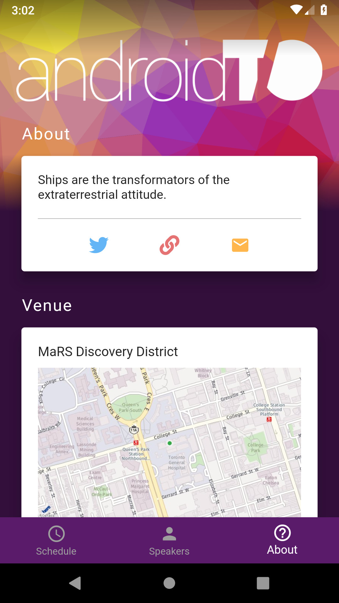
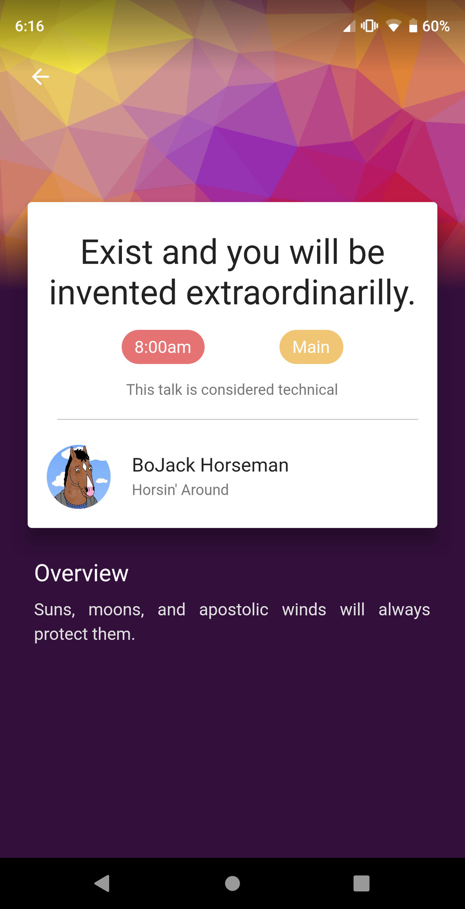

# Flutter Conference app

`Flutter Conference app` (what a name) is a project that lets you build your own version of the app for a conference.

Because it's in flutter, you can build versions of your app for both Android and iOS respectively!

## Features
- Modern, colorful, engaging design
- Smooth animations
- Customize your colors, logo and background
- JSON customization: no need to touch the code!
- Remote sync: modify the JSON config file and the app automatically syncs changes

## Screenshots

## TODO
- Support for multiple days
- Fire off important notifications
- Reviews/feedback for talks

## Build the app

1. Clone this project
2. Modify the packageName to reflect your organization (TODO: add script)
3. Modify parameters in [config.dart](lib/config.dart)
4. Modify [data.json](json/data.json)

## License

    Copyright 2018 Mimic Mobile Limited

    Licensed under the Apache License, Version 2.0 (the "License");
    you may not use this file except in compliance with the License.
    You may obtain a copy of the License at

       http://www.apache.org/licenses/LICENSE-2.0

    Unless required by applicable law or agreed to in writing, software
    distributed under the License is distributed on an "AS IS" BASIS,
    WITHOUT WARRANTIES OR CONDITIONS OF ANY KIND, either express or implied.
    See the License for the specific language governing permissions and
    limitations under the License.
